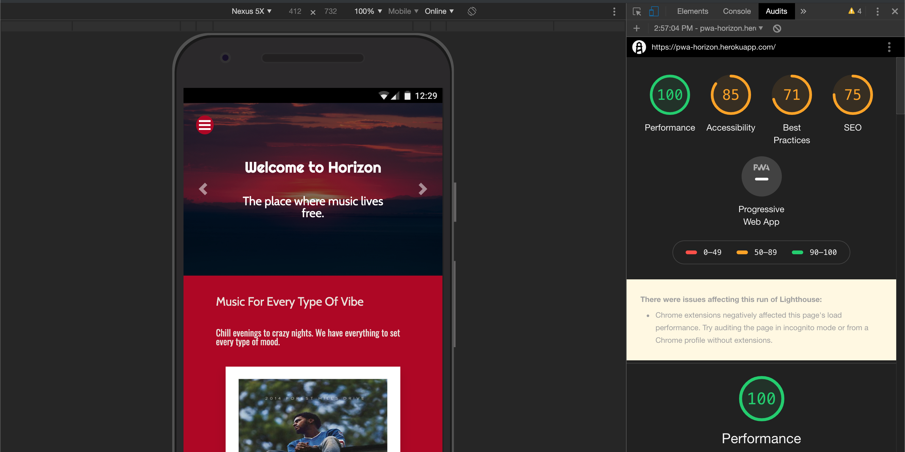
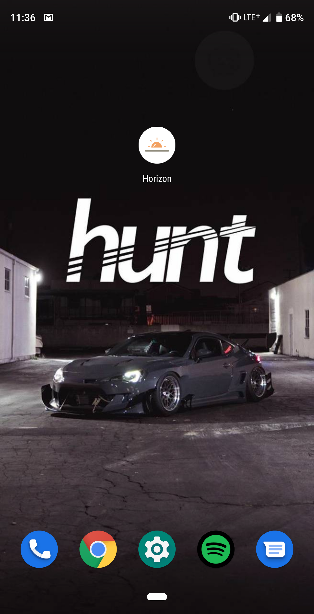
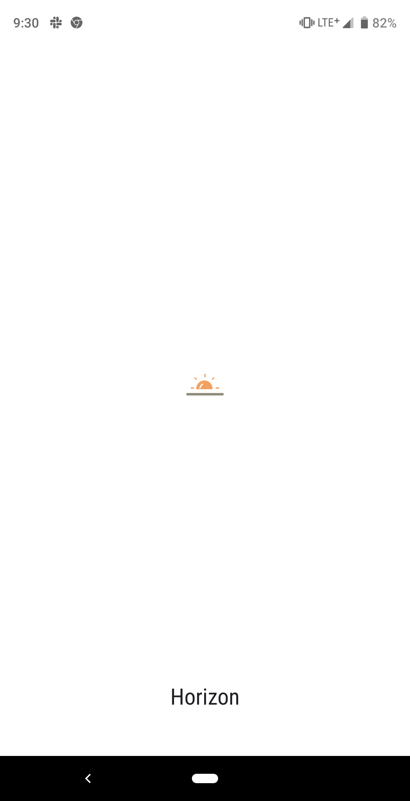
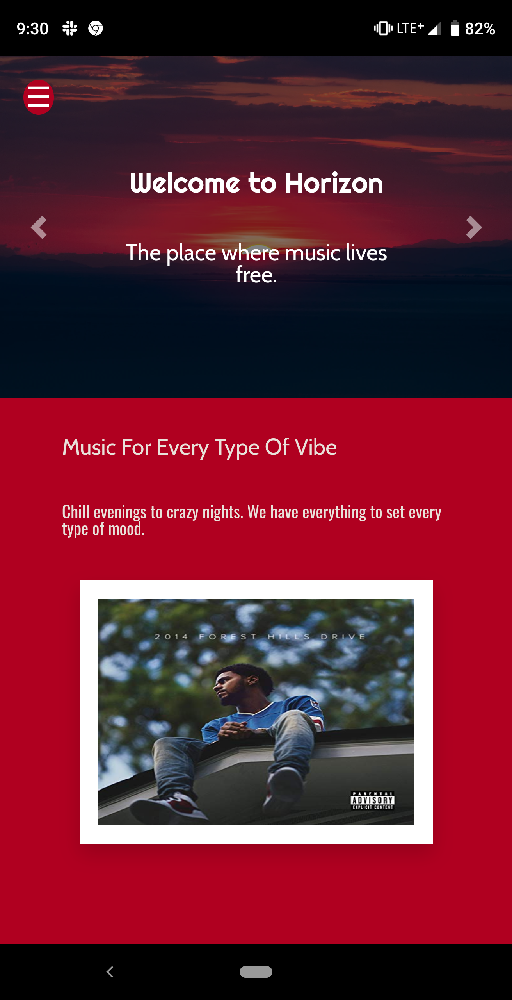
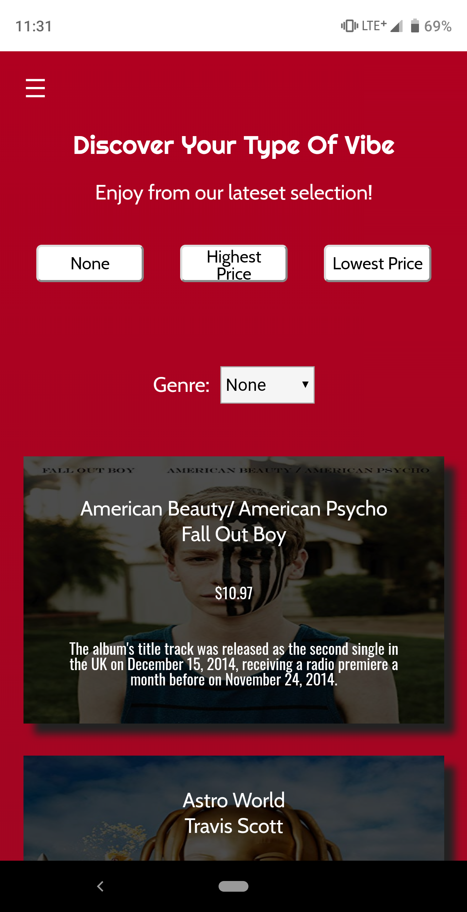
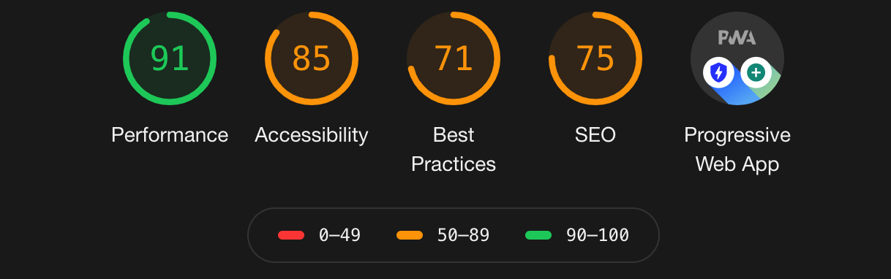

# Horizon Beyond

Sixth phase of ecommerce project "Horizon Beyond" using: 
React.js, MongoDb, Node.js, Express, bcrypt, and morgan.

## Getting Started

These instructions will get you a copy of the project up and running on your local machine for development and testing purposes. See deployment for notes on how to deploy the project on a live system.

### Installing

Use  ``` npm install ``` to install dependencies listed in package.json

You may run into a audit fix. Use ``` npm audit fix ``` to fix this issue.

If you still have a audit issue use ``` npm audit fix --force ``` to resolve the previous issue.

## Lighthouse Audit



## Lighthouse Audit







## Built With

* [Concurrently](https://www.npmjs.com/package/concurrently)
* [dotenv](https://www.npmjs.com/package/dotenv)
* [express](https://www.npmjs.com/package/express)
* [express-router](https://www.npmjs.com/package/express-router)
* [nodemon](https://www.npmjs.com/package/nodemon)
* [request](https://www.npmjs.com/package/request)
* [bcryptjs](https://www.npmjs.com/package/bcryptjs)
* [morgan](https://www.npmjs.com/package/morgan)

## Versioning

* [Horizon beyond](https://github.com/luisgaleas-clockwork/Horizon-Beyond)
* [Horizon beyond V2](https://github.com/luisgaleas-clockwork/Horizon-Beyond-React.js)
* [Horizon beyond V3](https://github.com/luisgaleas-clockwork/horizon-beyond-MySQL)

## License

This project is licensed under the MIT License - see the [LICENSE.md](LICENSE.md) file for details

## Inspiration

* [Spotify](https://www.spotify.com/)
* [Tidal](https://tidal.com/)
* [Apple-music](https://www.apple.com/apple-music//)


